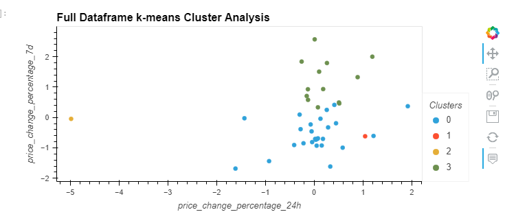

# Clustering_Crypto
Utilizes k-means clustering and the elbow method with principal component analysis to find significant clustering in crypto currency data before and after dimensional reduction.

## Installation Guide


## How to install panda, jupyter lab, hvplot. 
```python
    conda install pandas
    conda install jupyterlab
    conda install -c pyviz hvplot
```

To install the other dependencies not included in the anaconda environment run:
```python
    pip install -U scikit-learn
```

## Usage

To run this jupyter lab notebook you will need  GitBash to navigate to where you have exported the files

## Highlights
## This is a picture of a cluster analysis

## Contributors

Created by Austin Means while in the UW FinTech Bootcamp
> Contact Info:
> email: austinmeans92@gmail.com
## License

[MIT](LICENSE)

